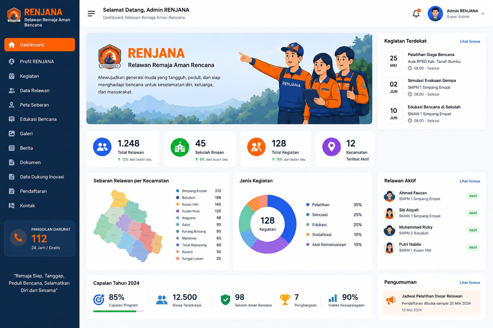

# RENJANA — Relawan Remaja Aman Bencana

[](https://go.dev/)
[](https://svelte.dev/)
[](https://inertiajs.com/)
[](https://tailwindcss.com/)
[](LICENSE)

**RENJANA** (Relawan Remaja Aman Bencana) adalah sistem informasi dashboard dan manajemen untuk program kebencanaan berbasis remaja di **Kabupaten Tanah Bumbu**. Dibangun di atas platform [Laju Go](https://github.com/maulanashalihin/laju-go) — arsitektur modern Go Fiber + Svelte 5 + Inertia.js 3 + SQLite yang telah teruji performanya.

Dashboard ini menyediakan layar komando (*command center*) bagi pengelola program untuk memantau relawan, kegiatan, sebaran per kecamatan, capaian tahunan, dan pengumuman — dalam satu halaman yang informatif dan responsif.

---

## 📸 Preview Dashboard



---

## 🚀 Quick Start

```bash
git clone https://github.com/maulanashalihin/renjana.git
cd renjana
cp .env.example .env
go mod download && npm install
npm run dev:all
```

Visit `http://localhost:8080` to see the dashboard running.

> 👶 **Baru pertama pakai Go?** Lihat [Panduan AI Setup](#-option-1-ai-setup-recommended-for-first-timers) — copas prompt ke AI assistant kesayangan Anda, selesai.

---

## ✨ Fitur RENJANA

### 📊 Dashboard Komprehensif

- **Statistik Ringkas** — Total Relawan, Sekolah Binaan, Total Kegiatan, Kecamatan Terlibat (lengkap dengan delta persentase)
- **Sebaran Relawan per Kecamatan** — 12 kecamatan dengan bar chart horizontal
- **Jenis Kegiatan** — Donut chart 5 segmen (Pelatihan, Simulasi, Edukasi, Sosialisasi, Aksi Kemanusiaan)
- **Relawan Aktif** — Daftar relawan dengan foto, nama, sekolah, dan status
- **Capaian Tahun 2024** — Progress bar persentase + metrik absolut
- **Kegiatan Terdekat** — Card upcoming activity
- **Pengumuman** — Informasi terkini program

### 🧭 Navigasi Lengkap (12 Modul)

1. **Dashboard** — Pusat komando
2. Profil RENJANA — Informasi organisasi
3. Kegiatan — Manajemen kegiatan
4. Data Relawan — Database relawan
5. Peta Sebaran — Visualisasi sebaran
6. Edukasi Bencana — Materi edukasi
7. Galeri — Dokumentasi foto/video
8. Berita — Publikasi berita
9. Dokumen — Arsip dokumen
10. Data Dukung Inovasi — Data pendukung
11. Pendaftaran — Registrasi relawan baru
12. Kontak — Informasi kontak

### 🛡️ Keamanan & Manajemen Pengguna

- **Autentikasi Email/Password** — Login aman dengan bcrypt
- **Google OAuth 2.0** — Login satu klik
- **Reset Password** — Pemulihan via email
- **Role-Based Access Control** — Admin/User roles
- **CSRF Protection** — Perlindungan built-in
- **Rate Limiting** — Throttle endpoint sensitif
- **Session Management** — Sesi berbasis database

### ⚡ Performa & Developer Experience

- **Hot Module Replacement (HMR)** — Update frontend instan via Vite
- **Go Hot Reload** — Air rebuild otomatis saat file Go berubah
- **Clean Architecture** — Handler → Service → Query (sqlc) → SQLite
- **TypeScript Ready** — Type safety penuh di frontend
- **Dark Mode** — Toggle light/dark siap pakai

### 🚢 Production Ready

- **SQLite Optimized** — WAL mode, connection pooling
- **Database Migrations** — Version control via Goose
- **Docker Support** — Multi-stage build
- **Systemd Ready** — Service management produksi
- **Litestream DR** — Replikasi SQLite ke S3

---

## 📚 Dokumentasi

| Section | Description |
|---------|-------------|
| [Product Requirements Document](PRD.md) | PRD lengkap untuk dashboard RENJANA |
| [Implementation Plan](PLAN.md) | Rencana implementasi teknis |
| [Second Opinion](SECOND_OPINION.md) | Critical review implementation plan |
| [Getting Started](docs/getting-started/introduction.md) | Introduction, installation, and configuration |
| [Architecture Guide](docs/guide/architecture.md) | Layered architecture, design patterns |
| [Routing & Handlers](docs/guide/routing.md) | Route definitions, middleware, and request handling |
| [Database](docs/guide/database.md) | SQLite setup, migrations, and query building |
| [Authentication](docs/guide/authentication.md) | Auth flows, OAuth, sessions, and password reset |
| [Frontend](docs/guide/frontend.md) | Svelte 5, React & Vue support via Inertia.js |
| [Deployment](docs/deployment/development.md) | Development workflow, production deployment, Docker, Litestream DR |
| [API Reference](docs/reference/api-reference.md) | Complete endpoint documentation |
| [Troubleshooting](docs/reference/troubleshooting.md) | Common issues and solutions |

---

## 📁 Project Structure

```
renjana/
├── cmd/laju-go/main.go        # Application entry point
├── app/                       # Backend Go code
│   ├── handlers/              # HTTP request handlers
│   ├── services/              # Business logic layer
│   ├── queries/               # Generated SQL query code (sqlc)
│   ├── middlewares/           # Request middleware
│   └── models/                # Data structures
├── frontend/                  # Svelte 5 frontend
│   └── src/
│       ├── components/        # Reusable UI components
│       ├── pages/             # Page components (Dashboard, Profile, Auth)
│       └── lib/               # Utilities and helpers
├── queries/                   # SQL source files (write queries here)
├── routes/                    # Route definitions
├── migrations/                # Database migrations
├── templates/                 # Templ templates (HTML + Go typed components)
├── docs/                      # Documentation
├── PRD.md                     # Product Requirements Document
├── PLAN.md                    # Implementation plan
├── SECOND_OPINION.md          # Critical review
└── design.jpeg                # Dashboard design reference
```

> 📖 See [Project Structure](docs/reference/project-structure.md) for a complete directory reference.

---

## 🛠️ Tech Stack

| Layer | Technology | Purpose |
|-------|------------|---------|
| **Backend** | Go 1.26+ | Programming language |
| **Web Framework** | Fiber v2 | High-performance HTTP framework (fasthttp) |
| **Database** | SQLite3 | Embedded SQL database |
| **Query Builder** | sqlc | Compile-time type-safe SQL code generation |
| **Migrations** | Goose | Database schema management |
| **Frontend** | Svelte 5 | Reactive UI framework |
| **Build Tool** | Vite 8 | Fast build tooling and dev server |
| **Styling** | Tailwind CSS 4 | Utility-first CSS framework |
| **Templating** | templ | Type-safe HTML components for Go |
| **SPA Bridge** | Inertia.js 3 | Server-driven single-page apps |
| **Icons** | Lucide Svelte | Beautiful, consistent icons |

### Why SQLite?

Kami menggunakan `modernc.org/sqlite` (pure Go) untuk kemudahan deployment:

- ✅ **Cross-compile** — `GOOS=linux GOARCH=amd64 go build` langsung jalan
- ✅ **Static binary** — Satu binary tanpa dependency eksternal
- ✅ **Docker/CI** — `FROM golang:alpine` works out of the box
- ✅ **Stack trace** — Full Go stack traces, no CGO opacity
- ✅ **Restart safety** — No stale CGO threads

Untuk kebutuhan >50K RPS, dapat beralih ke `mattn/go-sqlite3` (CGO).

> 📋 [Full Benchmark Report →](docs/benchmark/)

---

## 📦 Installation

### Prerequisites

- **Go** 1.26 or higher
- **Node.js** 18 or higher
- **SQLite3** (usually pre-installed on macOS/Linux)
- **Git** for version control

### ⭐ Option 1: AI Setup (Recommended for first-timers)

Tidak punya Go? Copas prompt ini ke AI coding assistant (Claude, ChatGPT, Gemini):

```text
Set up and run the RENJANA project (https://github.com/maulanashalihin/renjana) on this machine.

1. Check what OS I'm on (macOS/Linux/Windows) and install prerequisites if missing:
   - Go 1.26+ — install from https://go.dev/dl/ if not found
   - Node.js 18+ — install from https://nodejs.org/ if not found
   - Git — install if not found
   - SQLite3 — macOS/Linux usually have it pre-installed

2. Clone the repo and install dependencies:
   git clone https://github.com/maulanashalihin/renjana.git
   cd renjana
   go mod download
   npm install

3. Set up environment:
   cp .env.example .env
   Generate a random 32-character string for SESSION_SECRET in .env

4. Install Go dev tools (Air for hot reload, templ for templates):
   go install github.com/air-verse/air@latest
   go install github.com/a-h/templ/cmd/templ@latest
   Make sure ~/go/bin is in PATH

5. Start the dev server:
   npm run dev:all

6. Confirm it's running by visiting http://localhost:8080

Pause after each step if there are errors. Don't skip steps.
```

### Option 2: Manual Installation

```bash
# Clone
git clone https://github.com/maulanashalihin/renjana.git
cd renjana

# Install dependencies
go mod download
npm install

# Configure environment
cp .env.example .env
# Edit .env — set SESSION_SECRET minimal 32 karakter
```

---

## 🏃 Development

### Run Everything Together (Recommended)

```bash
npm run dev:all
```

### Run Servers Separately

```bash
# Terminal 1 — Vite dev server (frontend HMR)
npm run dev

# Terminal 2 — Go server with hot reload
air
# or
npm run dev:go
```

### Available Scripts

```bash
# Development
npm run dev          # Start Vite dev server
npm run dev:go       # Start Go server with Air hot reload
npm run dev:all      # Run both Vite and Air concurrently

# Production Build
npm run build        # Build frontend only (vite build)
npm run build:all    # Full production build: vite + go build
npm run build:linux  # Cross-compile binary for Linux (pure Go, no CGO)
npm run serve        # Run production binary (./laju-go)

# Testing
npm run test:run     # Run frontend tests
go test ./...        # Run all Go tests
```

### Development Workflow

| You Edit | What Happens |
|----------|--------------|
| `.svelte` files | Vite HMR updates instantly |
| `.go` files | Air rebuilds and restarts (~1-2 sec) |
| `.css` files | Hot reload (instant) |
| `migrations/` | Auto-run on server start |

---

## 🚀 Production Deployment

### 1. Build Locally

```bash
# Full production build (frontend + Go binary)
npm run build:all

# Or for Linux deployment from macOS:
npm run build:linux
```

This produces:

- **`laju-go`** — Static Go binary (pure Go SQLite, no CGO)
- **`dist/`** — Frontend assets (CSS/JS built by Vite)

### 2. Deploy Artifacts to Server

| Artifact | Purpose |
|----------|---------|
| `laju-go` | Go binary (the application) |
| `dist/` | Frontend assets |
| `migrations/` | SQL migrations (auto-run on startup) |
| `.env` | Environment configuration |

### 3. One-Click Deploy

```bash
cp .deploy.example .deploy
# Edit .deploy with your server details

npm run deploy
```

> See [One-Click Deployment Guide](docs/deployment/one-click-deployment.md) for full instructions.

### Docker Deployment

```bash
docker build -t renjana .
docker run -p 8080:8080 \
  -v $(pwd)/data:/root/data \
  -v $(pwd)/storage:/root/storage \
  renjana
```

### systemd Service

```bash
sudo nano /etc/systemd/system/renjana.service
```

```ini
[Unit]
Description=RENJANA Dashboard
After=network.target

[Service]
Type=simple
WorkingDirectory=/opt/renjana
ExecStart=/opt/renjana/laju-go
Restart=always
RestartSec=5
EnvironmentFile=/opt/renjana/.env

[Install]
WantedBy=multi-user.target
```

---

## 🔐 Default Admin Setup

Register akun pertama, lalu promote ke admin:

```bash
sqlite3 data/app.db "UPDATE users SET role = 'admin' WHERE email = 'your@email.com';"
```

---

## 🗄️ Database Migrations

Migrations run automatically on startup.

```bash
# Install goose
go install github.com/pressly/goose/v3/cmd/goose@latest

# Run all migrations
goose -dir migrations sqlite3 data/app.db up

# Check status
goose -dir migrations sqlite3 data/app.db status
```

---

## 📝 SQL Queries (sqlc)

```bash
# Install sqlc
go install github.com/sqlc-dev/sqlc/cmd/sqlc@latest

# Generate Go code from SQL files
npm run db:generate
```

| Directory | Purpose |
|-----------|---------|
| `queries/` | SQL source files — **write your queries here** |
| `app/queries/` | Generated Go code — **do not edit manually** |

---

## 📊 Performance Optimizations

### SQLite Production Settings (tuned for 1-2GB RAM)

| Setting | Value | Benefit |
|---------|-------|---------|
| `journal_mode` | WAL | Better write concurrency |
| `synchronous` | NORMAL | Faster writes with safety |
| `cache_size` | 16MB | Reduced disk I/O |
| `mmap_size` | 256MB | NVMe memory-mapped I/O |
| `temp_store` | MEMORY | Faster temp table operations |
| `busy_timeout` | 5000ms | Automatic retry on locks |
| Connection Pool | 15 max | Efficient connection reuse |

> 📖 Full guide: [SQLite Configuration Guide](docs/deployment/sqlite-configuration.md)

---

## 🤝 Contributing

1. Fork the repository
2. Create a feature branch (`git checkout -b feature/amazing-feature`)
3. Commit your changes (`git commit -m 'Add amazing feature'`)
4. Push to the branch (`git push origin feature/amazing-feature`)
5. Open a Pull Request

---

## 📄 License

MIT License — see [LICENSE](LICENSE) for details.

---

## 🙏 Acknowledgments

- [Laju Go](https://github.com/maulanashalihin/laju-go) — High-performance SaaS boilerplate yang menjadi fondasi proyek ini
- [Go Fiber](https://gofiber.io/) — Fast web framework
- [Svelte](https://svelte.dev/) — Cybernetically enhanced web apps
- [Inertia.js](https://inertiajs.com/) — Server-driven SPA
- [Tailwind CSS](https://tailwindcss.com/) — Utility-first CSS
- [Lucide Icons](https://lucide.dev/) — Beautiful, consistent icons
- **BPBD Kabupaten Tanah Bumbu** — Mitra program RENJANA

---

## 📞 Support

- **Dokumentasi**: [docs/](docs/) folder
- **Issues**: [GitHub Issues](https://github.com/maulanashalihin/renjana/issues)
- **PRD**: [PRD.md](PRD.md) — Product Requirements Document lengkap
