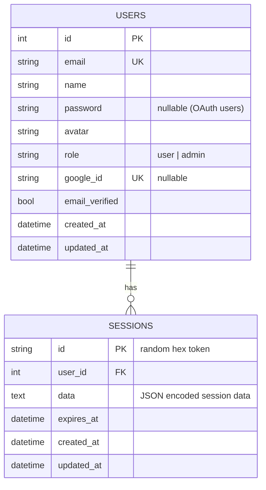

# Architecture

This document explains the architectural patterns and design decisions behind Laju Go.

## Overview

Laju Go follows a **layered architecture** that separates concerns into distinct layers. This pattern makes the codebase maintainable, testable, and scalable while keeping the overall structure simple — a single Go binary with no `cmd/` directory.

## High-Level Architecture

```
┌──────────────────────────────────────────────────────┐
│                   Browser / Client                    │
└──────────────────┬───────────────────────────────────┘
                   │ HTTP Request
                   ▼
┌──────────────────────────────────────────────────────┐
│                routes/web.go                          │
│         Route definitions + middleware chains         │
└──────────────────┬───────────────────────────────────┘
                   │
                   ▼
┌──────────────────────────────────────────────────────┐
│             app/middlewares/                          │
│   AuthRequired · AdminRequired · Guest · CSRF · Rate │
└──────────────────┬───────────────────────────────────┘
                   │
                   ▼
┌──────────────────────────────────────────────────────┐
│               app/handlers/                           │
│      Parse request → call service → return response   │
│      (no business logic — thin layer)                 │
└──────────────────┬───────────────────────────────────┘
                   │
                   ▼
┌──────────────────────────────────────────────────────┐
│               app/services/                           │
│      Business logic · Auth flows · External APIs      │
└──────────────────┬───────────────────────────────────┘
                   │
                   ▼
┌──────────────────────────────────────────────────────┐
│               app/queries/  (sqlc generated)          │
│      Type-safe SQL queries · Data access layer        │
└──────────────────┬───────────────────────────────────┘
                   │
                   ▼
┌──────────────────────────────────────────────────────┐
│                  SQLite Database                      │
│           (modernc.org/sqlite — pure Go)              │
└──────────────────────────────────────────────────────┘
```

## Architecture Layers

### 1. Routes Layer (`routes/web.go`)

**Purpose**: Define URL endpoints, apply middleware chains, and wire handlers.

**Responsibilities**:
- Map HTTP methods and paths to handler methods
- Apply middleware chains (auth, CSRF, rate limiting)
- Configure static file serving (`/dist`, `/public`, `/storage`)
- Define route groups (public, auth, protected, admin)

**Route Groups and Handlers**:

| Route Group | Middleware | Handler |
|-------------|-----------|---------|
| `/`, `/about` | None | `PublicHandler` |
| `/login`, `/register` | `Guest` | `AuthHandler` |
| `/auth/google` | None | `AuthHandler` |
| `/logout` | `AuthRequired` | `AuthHandler` |
| `/api/me`, `/api/avatar/:id` | `AuthRequired` | `AuthHandler` |
| `/forgot-password`, `/reset-password/:token` | None | `PasswordResetHandler` |
| `/app/*` | `AuthRequired` + `CSRF` | `AppHandler`, `UploadHandler` |
| `/admin/*` | `AuthRequired` + `AdminRequired` | Inline |

**Handlers Struct** — routes package defines a `Handlers` struct that bundles all handler instances:

```go
type Handlers struct {
    Public        *handlers.PublicHandler
    Auth          *handlers.AuthHandler
    App           *handlers.AppHandler
    Upload        *handlers.UploadHandler
    PasswordReset *handlers.PasswordResetHandler
}
```

**Route setup**:
```go
func SetupRoutes(app *fiber.App, handlers Handlers, store *session.Store, mailerService *services.MailerService, csrfMiddleware *middlewares.CSRFMiddleware) {
    setupStaticRoutes(app)
    setupPublicRoutes(app, handlers.Public)
    setupAuthRoutes(app, handlers.Auth, handlers.PasswordReset, store, mailerService)
    setupAppRoutes(app, handlers.App, handlers.Upload, store, csrfMiddleware)
}
```

---

### 2. Middleware Layer (`app/middlewares/`)

**Purpose**: Process requests before they reach handlers — gatekeeping, validation, and enrichment.

**Available Middleware**:

| Middleware | File | Purpose |
|------------|------|---------|
| `AuthRequired` | `auth.go` | Ensure user is authenticated (checks session for `user_id`) |
| `AdminRequired` | `auth.go` | Ensure user has admin role |
| `Guest` | `auth.go` | Redirect authenticated users away from login/register pages |
| `CSRF` | `csrf.go` | Validate CSRF tokens on state-changing requests |
| `AuthRateLimit` | `rate-limit.go` | Throttle login/register attempts per IP |
| `PasswordResetRateLimit` | `rate-limit.go` | Throttle password reset requests |

**Example — session-based auth**:
```go
func AuthRequired(store *session.Store) fiber.Handler {
    return func(c *fiber.Ctx) error {
        sess, _ := store.Get(c)
        userID := sess.Get("user_id")
        if userID == nil {
            if c.Get("X-Inertia") == "true" {
                return c.Status(fiber.StatusUnauthorized).JSON(fiber.Map{
                    "component": "Login",
                    "props":     fiber.Map{"error": "Please login"},
                })
            }
            return c.Redirect("/login")
        }
        c.Locals("user_id", userID)
        return c.Next()
    }
}
```

---

### 3. Handler Layer (`app/handlers/`)

**Purpose**: Handle HTTP requests — parse input, call services, return responses.

**Responsibilities**:
- Parse request body, params, and query strings
- Validate input (basic checks — business rules go in services)
- Call appropriate service methods
- Return responses via `inertiaService.Render()` or `c.JSON()`/`c.Redirect()`
- Handle errors with user-friendly messages

**Handler Files**:

| File | Struct | Handlers |
|------|--------|----------|
| `auth.go` | `AuthHandler` | Login, Register, Logout, Google OAuth, Me, GetAvatar |
| `app.go` | `AppHandler` | Dashboard, Profile, UpdateProfile, UpdatePassword |
| `public.go` | `PublicHandler` | Index (landing page), About |
| `upload.go` | `UploadHandler` | File upload |
| `password-reset.go` | `PasswordResetHandler` | Forgot password, Reset password |

**Key rule**: Handlers are **thin**. No business logic — delegate to services.

**Example**:
```go
func (h *AuthHandler) Login(c *fiber.Ctx) error {
    var req models.LoginRequest
    if err := c.BodyParser(&req); err != nil {
        return c.Status(400).JSON(fiber.Map{"error": "Invalid request body"})
    }

    user, err := h.authService.Login(req.Email, req.Password)
    if err != nil {
        h.store.Flash(c, "error", "Invalid email or password")
        return c.Redirect("/login")
    }

    sess, _ := h.store.Get(c)
    sess.Set("user_id", user.ID)
    sess.Set("email", user.Email)
    sess.Set("role", string(user.Role))
    sess.Save()

    return c.Redirect("/app")  // Inertia follows this redirect
}
```

**Inertia response pattern** — most handlers return Inertia responses:
```go
return h.inertiaService.Render(c, "app/Dashboard", fiber.Map{
    "user": user,
})
```

---

### 4. Service Layer (`app/services/`)

**Purpose**: Implement business logic. This is where the application's core behavior lives.

**Responsibilities**:
- Authentication (email/password, Google OAuth)
- User management (profile CRUD, password change)
- Email sending (password reset, notifications)
- Inertia.js response rendering
- Vite asset manifest resolution (dev vs production)
- Business rules enforcement
- Cache coordination

**Service Files**:

| File | Struct | Purpose |
|------|--------|---------|
| `auth.go` | `AuthService` | Authentication logic (register, login, OAuth), password hashing |
| `user.go` | `UserService` | Profile CRUD, cache coordination, role checks |
| `inertia.go` | `InertiaService` | Inertia.js page rendering (HTML initial load + JSON XHR) |
| `asset.go` | `AssetService` | Vite manifest resolution, dev server detection |
| `mailer.go` | `MailerService` | SMTP email sending |

**All services depend on `*queries.Querier`** for data access:

```go
type AuthService struct {
    querier       *queries.Querier
    oauthConfig   *oauth2.Config
}

type UserService struct {
    querier *queries.Querier
    cache   *cache.UserCache  // In-memory TTL cache
}
```

**Example**:
```go
func (s *AuthService) Login(email, password string) (*models.User, error) {
    user, err := s.querier.GetUserByEmail(context.Background(), email)
    if err != nil {
        if errors.Is(err, queries.ErrUserNotFound) {
            return nil, ErrInvalidCredentials
        }
        return nil, err
    }
    if !user.Password.Valid {
        return nil, ErrInvalidCredentials // OAuth-only user
    }
    if !checkPassword(user.Password.String, password) {
        return nil, ErrInvalidCredentials
    }
    return user, nil
}
```

---

### 5. Queries Layer — sqlc (`app/queries/`)

**Purpose**: Type-safe data access layer, **automatically generated by sqlc**.

**This is a critical architectural decision**: Instead of hand-writing repository interfaces and implementations, Laju Go uses [sqlc](https://sqlc.dev/) to generate type-safe Go code from SQL.

**Workflow**:
1. Write SQL queries in `queries/*.sql` (source files)
2. Run `npm run db:generate` → sqlc generates `app/queries/*.go`
3. Use the generated `Querier` in your services

**Generated Files**:

| File | Source |
|------|--------|
| `db.go` | Transaction and database helpers |
| `models.go` | Go structs matching database tables |
| `querier.go` | Interface + implementation for all queries |
| `user.sql.go` | User CRUD queries |
| `session.sql.go` | Session CRUD queries |
| `session_helpers.go` | Session helper functions |

**Why sqlc over hand-written repositories?**

| Approach | Boilerplate | Type Safety | Performance |
|----------|-------------|-------------|-------------|
| **sqlc** (generated) | Zero (generated) | Full (compile-time) | Native SQL |
| Hand-written repos | High | Manual | ORM overhead |
| ORM (GORM, etc.) | Low | Partial | Reflection cost |

---

### 6. Models Layer (`app/models/`)

**Purpose**: Define data structures used across layers.

**Files**:

| File | Purpose |
|------|---------|
| `user.go` | `User` domain model with `UserRole` type (admin/user) |
| `dto.go` | Request/Response DTOs (`RegisterRequest`, `LoginRequest`, `UpdateProfileRequest`, `UserResponse`) |
| `session.go` | Session data model |

**Pattern — `ToResponse()` method for safe data exposure**:

```go
type User struct {
    ID            int64          `json:"id"`
    Email         string         `json:"email"`
    Name          string         `json:"name"`
    Avatar        string         `json:"avatar"`
    Password      sql.NullString `json:"-"` // Never exposed in JSON
    Role          UserRole       `json:"role"`
    GoogleID      sql.NullString `json:"-"` // Never exposed
    EmailVerified bool           `json:"email_verified"`
    CreatedAt     time.Time      `json:"created_at"`
    UpdatedAt     time.Time      `json:"updated_at"`
}

func (u *User) ToResponse() UserResponse {
    return UserResponse{
        ID:    u.ID,
        Email: u.Email,
        Name:  u.Name,
        // Excludes Password, GoogleID — never leaked
    }
}
```

---

### 7. Session Layer (`app/session/`)

**Purpose**: Infrastructure layer for session management — intentionally separate from services.

**Details**:

| Aspect | Detail |
|--------|--------|
| Location | `app/session/session.go` (not in `app/services/`) |
| Storage | SQLite database-backed (via `queries.Querier`) |
| Transport | HTTP-only cookie (`session_id`) |
| Lifetime | 24 hours default |
| API | `store.Get()` → `Session{Get, Set, Save, Destroy, Regenerate}` |
| Flash messages | `store.Flash()` / `store.GetFlash()` — one-time cookies |

**Why separate from services?**

1. **Reusability**: Session infrastructure can be used in any Fiber project
2. **Clear responsibilities**: Session knows nothing about users or auth
3. **Flexibility**: Easy to swap implementation (cookie → Redis)

**Dependency relationship**:
```
services/auth.go  →  session/session.go  →  queries/session.sql.go
   (Business)         (Infrastructure)        (Data access)
```

---

### 8. Config Layer (`app/config/`)

**Purpose**: Centralized configuration loaded from environment variables / `.env`.

```go
type Config struct {
    AppPort            string
    AppEnv             string
    DBPath             string
    GoogleClientID     string
    GoogleClientSecret string
    // ... SMTP, CORS, Cache TTL
}
```

Loaded once at startup via `config.Load()`.

---

### 9. Cache Layer (`app/cache/`)

**Purpose**: In-memory TTL cache for user profiles to reduce database queries.

```go
type UserCache struct {
    mu   sync.RWMutex
    data map[int64]cacheEntry
    ttl  time.Duration  // Configurable via USER_CACHE_TTL env var
}
```

Used by `UserService` for profile lookups and role checks. Automatically invalidated on updates.

---

## Request Flow

### Initial Page Load (HTML)

```
Browser ──GET /──▶ routes/web.go ──▶ PublicHandler.Index()
                                           │
                                           ▼
                                    AssetService.GetAssetData()
                                           │
                                           ▼
                                    templates.LandingPage()
                                           │
                                           ▼
                                    Full HTML page response
```

### Inertia Navigation (JSON XHR)

```
Browser ──GET /app (X-Inertia: true)──▶ AuthRequired middleware
                                              │
                                              ▼
                                         session.Store.Get()
                                              │
                                              ▼
                                         AppHandler.Dashboard()
                                              │
                                              ▼
                                         UserService.GetProfile()
                                              │
                                         ┌────┴────┐
                                         │  Cache  │
                                         └────┬────┘
                                              │
                                         queries.Querier
                                              │
                                              ▼
                                         InertiaService.Render()
                                              │
                                              ▼
                                    JSON {component, props, url}
```

### Authentication Flow

```
Browser ──POST /login──▶ AuthHandler.Login()
                               │
                          AuthService.Login()
                               │
                          queries.GetUserByEmail()
                               │
                          bcrypt.CompareHashAndPassword()
                               │
                          session.Set("user_id", user.ID)
                          session.Save()
                               │
                          Redirect /app (Inertia follows)
```

## Dependency Injection

Laju Go uses **constructor-based dependency injection** wired in `cmd/laju-go/main.go`:

```go
func main() {
    cfg := config.Load()

    db, _ := initDatabase(cfg.DBPath)
    runMigrations(db, "./migrations")

    querier := queries.NewQuerier(db)
    userCache := cache.NewUserCache(cfg.UserCacheTTL)
    sessionStore := session.New(querier)

    authService := services.NewAuthService(querier, services.AuthServiceConfig{...})
    userService := services.NewUserService(querier, userCache)
    assetService := services.NewAssetService("./dist/.vite/manifest.json", ".vite-port")
    inertiaService := services.NewInertiaService(assetService, sessionStore)

    routeHandlers := routes.Handlers{
        Public: handlers.NewPublicHandler(authService, userService, inertiaService, assetService),
        Auth:   handlers.NewAuthHandler(authService, userService, sessionStore, inertiaService),
        App:    handlers.NewAppHandler(userService, sessionStore, inertiaService),
        Upload: handlers.NewUploadHandler(sessionStore, userService),
    }

    csrfMiddleware := routes.SetupCSRFMiddleware(sessionStore)
    // ... mailer, password reset ...

    app := fiber.New()
    routes.SetupRoutes(app, routeHandlers, sessionStore, mailerService, csrfMiddleware)
    app.Listen(":" + cfg.AppPort)
}
```

**Dependency graph**:
```
config.Load() → database/sql (SQLite via modernc.org)
                     │
                     ├──→ queries.Querier (sqlc)
                     │         ├──→ AuthService
                     │         ├──→ UserService ←── cache.UserCache
                     │         └──→ session.Store
                     │
                     └──→ migrations (goose, auto-run on startup)

asset.AssetService → inertia.InertiaService ←── session.Store
                                    │
handlers.* ←── services.*, session.Store
                    │
              routes.SetupRoutes()
```

## Frontend Architecture

### Inertia.js Pattern

Laju Go uses [Inertia.js](https://inertiajs.com/) to create a single-page app experience:

```
Initial page load:
  Browser ──GET──▶ Server ──render──▶ templates.InertiaPage (HTML shell)
                                         └── JSON page data embedded in script tag
                                              {component, props, url}

Subsequent navigation:
  Browser ──XHR (X-Inertia: true)──▶ Server ──JSON──▶ Browser
                                        {component, props, url}
  Svelte swaps components without full page reload
```

### Component Structure

```
frontend/src/
├── main.ts                    # Inertia initialization (createInertiaApp)
├── app.css                    # Global styles (Tailwind)
├── components/                # Reusable UI components
│   ├── Button.svelte
│   ├── Input.svelte
│   ├── Header.svelte
│   └── DarkModeToggle.svelte
├── layouts/                   # Layout components
├── lib/                       # Utilities (api, i18n, types, utils)
└── pages/                     # Page components
    ├── auth/                  # Login, Register, ForgotPassword, ResetPassword
    ├── app/                   # Dashboard, Profile
    └── admin/                 # (future)
```

### Templ Templates

The `templates/` directory contains Go `templ` components:

| Template | Purpose |
|----------|---------|
| `InertiaPage.templ` | HTML shell for Inertia initial page load |
| `LandingPage.templ` | Public landing/home page |

Templ is type-safe HTML generation compiled to Go code at build time.

## Response Patterns

### Inertia Pages (Most Routes)

All protected routes use `inertiaService.Render()`:
```go
return h.inertiaService.Render(c, "app/Dashboard", fiber.Map{
    "user": user,
})
```

### Direct HTML (Landing Page)
```go
return templates.LandingPage("Welcome", viteURL, mainCSS).Render(c.Context(), c.Response().BodyWriter())
```

### API Endpoints (JSON)
Some endpoints return raw JSON (`/api/me`, `/api/avatar/:id`):
```go
c.JSON(fiber.Map{"user": user.ToResponse()})
```

### Redirects (POST Handlers)
State-changing requests always redirect:
```go
c.Redirect("/app")  // Inertia follows automatically
```

## Key Architectural Decisions

### Why sqlc Instead of ORM/Repository Pattern?

1. **Type safety at compile time** — SQL errors caught before runtime
2. **Zero boilerplate** — queries are generated, not written by hand
3. **Full SQL power** — no ORM limitations for complex queries
4. **Single source of truth** — SQL is the canonical query language

### Why modernc.org/sqlite (Pure Go)?

- **Static binary** — single file deployment, no CGO
- **Cross-compilation** — `GOOS=linux GOARCH=amd64 go build` just works
- **No system dependencies** — works on scratch Docker images

### Why Inertia.js Instead of API + SPA?

- **No API versioning** — server and client are in same codebase
- **Direct service calls** — no HTTP overhead for data fetching
- **Simplified auth** — session-based, no JWT/token management
- **SEO-friendly** — initial page load is full HTML

### Why `app/session/` Is Separate from `app/services/`?

- Session is infrastructure (cookie management, storage)
- Services are business logic (auth, user management)
- Keeps session swappable without touching business logic

## Database Design

### Schema Overview



### Design Principles

1. **Foreign keys** — enforce referential integrity
2. **Indexes** — email and google_id for fast lookups
3. **Nullable fields** — `google_id` and `password` are nullable (OAuth vs email auth)
4. **Hard deletes** — sessions are hard-deleted on logout

## Best Practices

### 1. Keep Layers Thin

Handlers delegate to services; services use the Querier:

```go
// ✅ Handler is thin
func (h *AuthHandler) Login(c *fiber.Ctx) error {
    var req models.LoginRequest
    c.BodyParser(&req)
    user, err := h.authService.Login(req.Email, req.Password)
    if err != nil {
        h.store.Flash(c, "error", "Invalid credentials")
        return c.Redirect("/login")
    }
    sess, _ := h.store.Get(c)
    sess.Set("user_id", user.ID)
    sess.Save()
    return c.Redirect("/app")
}

// ❌ Business logic in handler — wrong
func (h *Handler) Login(c *fiber.Ctx) error { /* ... */ }
```

### 2. Use DTOs for API Responses

```go
// User.ToResponse() excludes Password, GoogleID
userResponse := user.ToResponse()
```

### 3. POST Handlers Always Redirect

```go
c.Redirect("/app")  // Inertia auto-follows
```

### 4. Use Flash Messages for Feedback

```go
h.store.Flash(c, "error", "Invalid email or password")
return c.Redirect("/login")
// Flash is auto-injected into inertia props
```

### 5. Handle Errors Gracefully

```go
if err == services.ErrInvalidCredentials {
    return c.Status(401).JSON(fiber.Map{
        "error": "Invalid email or password",
    })
}
```

## Next Steps

- [Routing Guide](routing.md) — Route definitions and middleware
- [Database Guide](database.md) — SQLite setup, sqlc, and migrations
- [Authentication Guide](authentication.md) — Auth flows and session management
